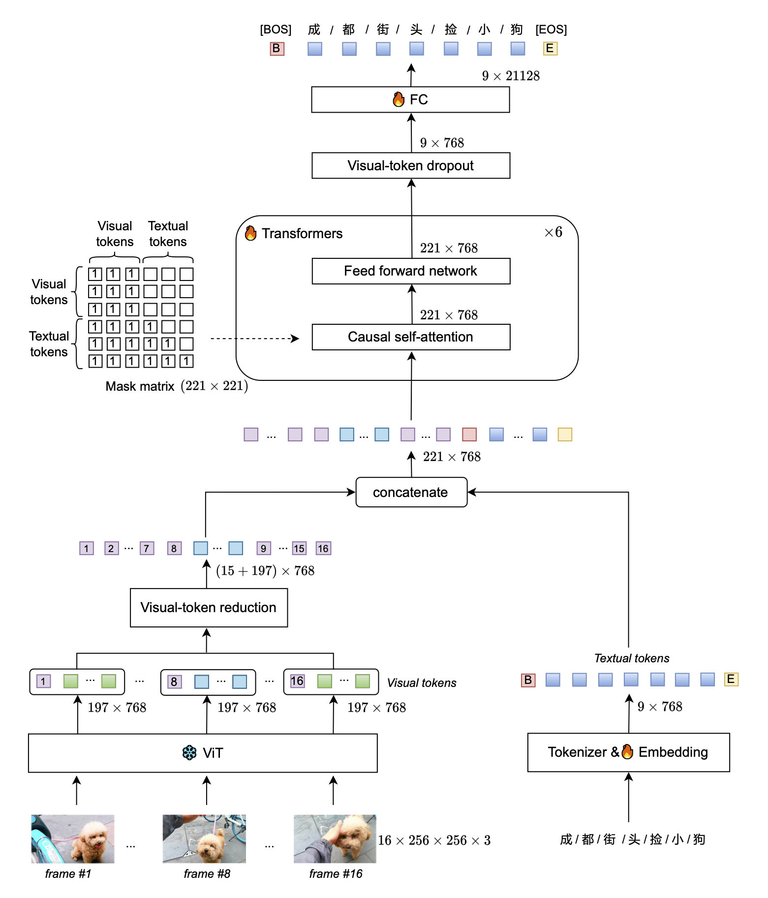

# GVT: Generative Video-to-text Transformer 

## Prepare
- install requirements:
  ```bash
  pip install git+https://github.com/microsoft/azfuse.git
  pip install -r requirements.txt
  ```
  Install PyTorch and torchvision following the [official instructions](https://pytorch.org/), e.g., 
  ```conda install pytorch torchvision -c pytorch
  ```


- prepare input data:
  - One txt file, each line is an absolute directory of a video's frames.
  - Or just an absolute path of a video file.
- download examples and checkpoint:
  ```
  bash down.sh
  ```
## Demo
[Jupyter notebooks](demo.ipynb) / [Google Colab](https://colab.research.google.com/gist/dong03/2fffdbaeb3d0fcae220fd2522cfd3ef6/inference_gvt.ipynb)

## Inference
see ./generativeimage2text/infer.sh 
- inference on single video
  ```bash
  # single video
  cd generativeimage2text
  TOKENIZERS_PARALLELISM=false CUDA_VISIBLE_DEVICES=<GPU_id> python infer.py \
      --config ../config/infer.yaml \
      --output_dir ../ckpt/results/ \
      --checkpoint ../GVT_ChinaOpen.pth \
      --min_length 15 \
      --beam_size 10 \
      --max_length 32 \
      --max_input_length 48 \
      --to_be_infered ../demo/videos/BV1CN411o7WE.mp4 \
      --use_video
  
  ```
- inference on single frames dir
  ```bash
  # single images dir
    cd generativeimage2text
    TOKENIZERS_PARALLELISM=false CUDA_VISIBLE_DEVICES=<GPU_id> python infer.py \
        --config ../config/infer.yaml \
        --output_dir ../ckpt/results/ \
        --checkpoint ../GVT_ChinaOpen.pth \
        --min_length 15 \
        --beam_size 10 \
        --max_length 32 \
        --max_input_length 48 \
        --to_be_infered ../demo/frames/BV1CN411o7WE
  ```
- inference on batch
  ```bash
  # batch
  cd generativeimage2text
  TOKENIZERS_PARALLELISM=false CUDA_VISIBLE_DEVICES=<GPU_id> python infer.py \
      --config ../config/infer.yaml \
      --output_dir ../demo/results/ \
      --checkpoint ../GVT_ChinaOpen.pth \
      --min_length 15 \
      --beam_size 10 \
      --max_length 32 \
      --max_input_length 48 \
      --to_be_infered ../demo/demo.txt
  ```
- run infer.sh
  ```bash
  cd generativeimage2text
  bash infer.sh <GPU_id>
  ```

